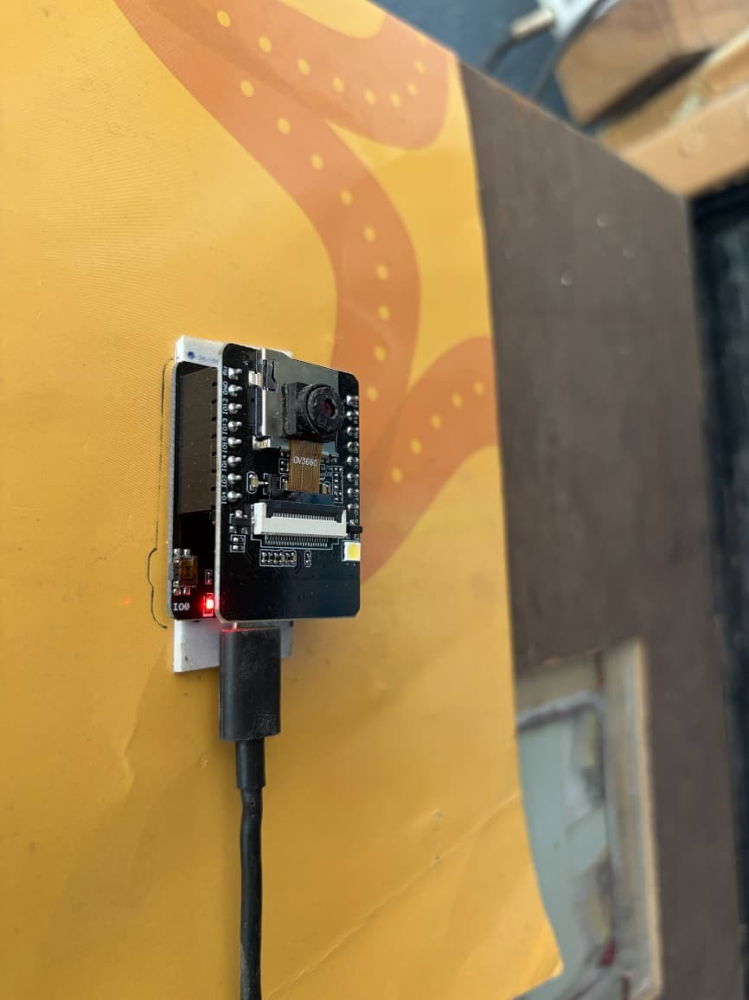
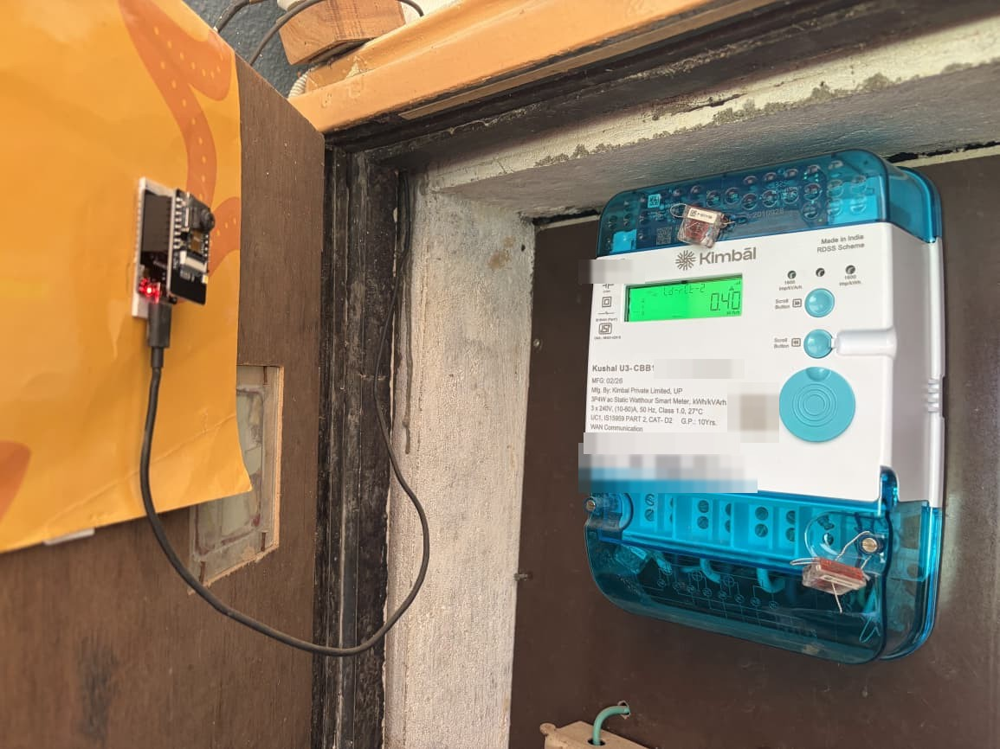
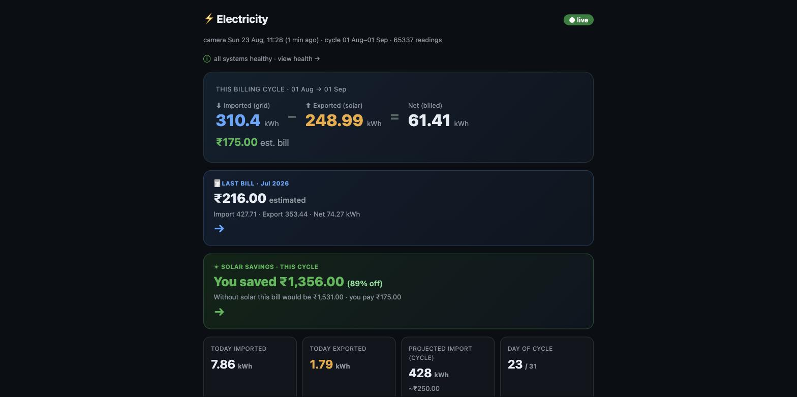
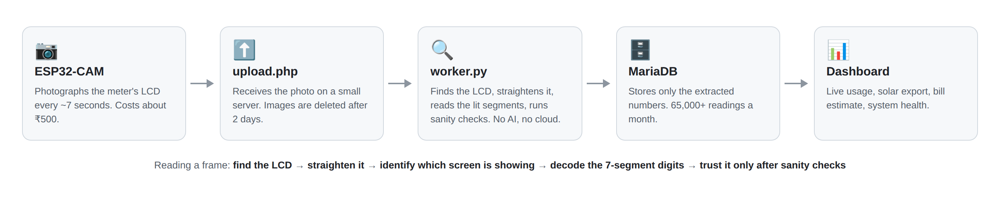

# MeterEye

**A ₹500 camera that reads my electricity meter every 7 seconds, because the electricity board only tells me once a month.**

My power bill was always a surprise. The board's portal updates monthly, the meter is sealed with no data port, and the only way to check was to walk outside and squint at a tiny LCD. So I pointed a small camera at that LCD and taught it to read the numbers. No smart meter, no electrician, nothing touches the wiring.

<p align="center">
  
  &nbsp;
  
</p>
<p align="center"><em>The whole hardware: an ESP32-CAM (~₹500) mounted facing the meter's LCD.</em></p>

## What it does

<p align="center">
  
</p>

Every ~7 seconds the camera photographs the meter. A Python worker reads the digits with a **custom 7-segment decoder** (no OCR engine, no cloud vision API, no ML) and a small PHP dashboard turns 65,000+ readings a month into answers:

- **What will this month's bill be?** Estimated to the rupee, verified against real paper bills.
- **Is my solar paying off?** Live import vs export, and what the bill would have been without panels. This cycle: ₹1,531 down to ₹175, an 89% saving.
- **What's happening right now?** Per-phase voltage, current and power factor, updated live.

## How it works

<p align="center">
  
</p>

<details>
<summary>Text version of the pipeline</summary>

```
ESP32-CAM ──HTTP──▶ upload.php (saves jpg)
                       │
                  storage/eb_images/   (auto-deleted after 2 days)
                       │  cron every 1 min
                  worker.py: rectify LCD → classify screen
                             → decode 7-seg value → sanity/dedupe → INSERT
                       ▼
                  MariaDB: readings / settings / cycle_baseline / worker_state
                       ▼
                  dashboard · detail (analytics) · health · settings
```
</details>

## Why this was hard

The meter has no data port. No Modbus, no pulse output, nothing. The only interface is a small LCD that cycles through several screens (import kWh, export kWh, voltage/current per phase, power factor, max demand). Reading it visually means:

1. **Detect + rectify**: find the bright LCD quad in the frame, perspective-warp it to a canonical size.
2. **Classify the screen**: a template match on the label zone (plus first/last-character gates) identifies which of the ~10 screens you're looking at.
3. **Decode the value**: a fixed 6-cell grid, each cell decoded by which of the 7 segments are lit. Not a generic OCR model, just segment geometry.
4. **Sanity-check before trusting it**: see "Reliability" below. This is the part that actually makes the system usable.

Raw per-frame misreads on the billing registers run ~28-31% (glare on the LCD flips digits). That number never improved through threshold tuning, so the system doesn't try to prevent misreads. It makes them harmless.

## Reliability: guards + self-heal

A single misread on a *cumulative* register (a value that should only ever go up) is dangerous. It can look like your usage jumped by 900 units overnight. Four independent guards, each added after a real production incident, catch this:

1. **Sibling cross-check**: import/export registers get mislabeled occasionally; they are cross-checked against each other.
2. **Forward-jump hold**: a big upward jump is held pending until a second frame confirms it. Glare is rarely identical twice in a row, except when it is, which is why guard 4 exists.
3. **Backward-value rejection**: a cumulative register can't decrease. Reject outright, and let a confirmed duplicate clear anything pending.
4. **Physics cap**: reject a jump that exceeds a plausible max-rate ceiling *and* whose value would fall back in range if you dropped a leading digit (the classic glare-flips-a-digit-by-10x pattern). This one is specifically for jumps that repeat identically across frames, which guard 2 alone can't catch.

On top of the guards, an hourly `ocr_health.py` job compares registers against a global-median consensus and can auto-*lower* a register that's stuck reading high (it never inflates a value). A second line of defense that doesn't depend on catching the bad frame in real time.

Regression tests for all of this live in `worker/test_guard.py`, including a replay of a real past incident. Run them before touching the decode/guard logic.

## Billing math, verified against real bills

The dashboard estimates your bill using a slab tariff. The **regulatory surcharge** line item is not what most tariff sheets suggest (a flat % of the energy charge). It was reverse-engineered by comparing four consecutive real paper bills and turns out to be:

```
surcharge = round(10% × (energy_charge_rounded + fixed_charge))
```

This matched every one of four bills to the exact rupee. **Subsidy and prompt-payment rebate are not formula-derivable.** They varied (₹125/₹99/₹70...) bill to bill with no discernible pattern, so this system doesn't try to predict them; it shows a pre-subsidy estimate.

## Hardware

- AI-Thinker ESP32-CAM. Needs PSRAM for a large enough frame size; VGA is too low-res for reliable digit decoding, use XGA/1024×768.
- USB-TTL adapter to flash it (the AI-Thinker board has no onboard USB).
- A way to mount the camera facing the meter's LCD, close enough and stable enough that the same calibration holds. Lighting matters more than resolution. This is the part most likely to need iteration for your specific meter/enclosure.

Total cost: roughly ₹500 (~$6).

## Repo layout

```
firmware/
  CameraWebServer_legacy/   simplest working sketch — hardcoded config,
                             good starting point to prove the concept
  platformio-firmware/      production-track firmware: NVS-backed config,
                             SoftAP captive-portal onboarding (no recompiling
                             to change WiFi/server), OTA-ready partitioning
  PLAN.md                   the fleet/multi-device roadmap this is built toward
worker/
  lab.py                    OCR core: LCD rectify + 7-segment decoder
  labels.py                 screen classifier + phase/unit detection
  worker.py                 the cron daemon: new frames → readings
  calibrate.py              re-calibration helper (run if the camera moves)
  calibration.example.json  example calibration — yours WILL differ, recalibrate
  ocr_health.py             hourly consensus self-heal job
  test_guard.py             regression tests for the misread guards
  refs/                     template images for screen-label classification
web/
  upload.php                ESP32 upload endpoint (API-key checked)
  dashboard.php              summary: import/export/net, cost, live status
  detail.php                 analytics: daily bars, per-cycle, voltage/current
  bills.php                   per-cycle bill estimate + breakdown vs. actual
  savings.php                 solar savings estimate (conservative floor)
  health.php                 live status board
  settings.php                admin (key-locked): tariff, billing day, baselines
  monitor.php                 health checker (run by cron; Telegram/email alerts)
  snapshot_baseline.php       monthly auto-baseline (run by cron)
  _lib.php                    shared PHP (db, settings, cycle math, cost, liveness)
db/schema.sql                readings, readings_raw, settings, cycle_baseline,
                              cycle_actual(_edits), worker_state + seed data
config.example.php           copy to config.php and fill in your own secrets
```

## Setup

1. **Database**: `mysql < db/schema.sql` against a fresh DB. Create a dedicated app user with SELECT/INSERT on `readings` and **no DELETE grant** (the guards depend on the app never being able to rewrite history). `readings_raw` is the one exception: the app needs DELETE there too, since `ocr_health.py` prunes it on a 30-day rolling window. `cycle_actual`/`cycle_actual_edits` back an optional feature in `bills.php`: record the real bill once it arrives, see variance against the estimate, with edits kept as an audit trail.
2. **Config**: copy `config.example.php` → `config.php` and fill in a random `UPLOAD_KEY`, your DB credentials, and the paths at the bottom. Everything environment-specific lives here; nothing is hardcoded in the app. Set `EB_CONFIG` if your `config.php` lives outside the repo. Never commit `config.php`.
3. **Web**: serve `web/` behind your web server of choice; point `storage/eb_images/` somewhere writable by whatever user runs the worker.
4. **Worker**: `python3 -m venv venv && venv/bin/pip install -r worker/requirements.txt`, then cron `worker.py` every minute, `snapshot_baseline.php` once a month, `monitor.php` every few minutes, `ocr_health.py` hourly, and an image cleanup job (uploaded JPEGs aren't kept long; only the extracted numbers are). Wrap `worker.py` and `ocr_health.py` in `flock -n` against a lock file so an occasional slow run doesn't overlap the next cron tick:

   ```cron
   * * * * *   flock -n /tmp/eb_worker.lock      venv/bin/python worker/worker.py       >> worker.log 2>&1
   50 * * * *  find storage/eb_images -name "*.jpg" -mmin +2880 -delete
   0 1 * * *   php web/snapshot_baseline.php     >> baseline.log 2>&1
   */5 * * * * php web/monitor.php               >> monitor.log 2>&1
   15 * * * *  flock -n /tmp/eb_ocr_health.lock   venv/bin/python worker/ocr_health.py --hours=4 >> ocr_health.log 2>&1
   ```
5. **Calibrate**: run `worker/calibrate.py` pointed at your own camera frames. The shipped `calibration.example.json` is specific to one physical mount and will not just work for yours.
6. **Firmware**: start with `firmware/CameraWebServer_legacy/` to prove your camera/mount/lighting works at all (fill in WiFi/server/API key at the top of the `.ino`, do not commit real values), then move to `firmware/platformio-firmware/` for the captive-portal onboarding flow. See `firmware/platformio-firmware/README.md`.

## Known limitations / roadmap

Being upfront about what this doesn't do yet:

- **The dashboard has no login.** `dashboard.php`/`detail.php`/`health.php` are unauthenticated by default; only `settings.php` is key-gated. Usage patterns are a rough presence/absence signal, so put basic auth in front of these before deploying anywhere public.
- **Subsidy/rebate aren't modeled.** See "Billing math" above; they're government/board-set per bill, shown as a placeholder, not computed.
- **Calendar-month vs actual-meter-read-date drift.** This system snapshots a billing-cycle baseline on the 1st of the calendar month, but electricity boards often read the physical meter several days before month-end. A monthly total here can differ from the real bill by the handful of units consumed in that gap. The fix (track the board's actual read-date pattern) is on the list but not done.
- **TLS is not fully validated** on the firmware's upload connection (`setInsecure()` in `uploader.cpp`). Fine on a private network, not hardened for anything more adversarial.
- The `platformio-firmware/PLAN.md` roadmap (fleet onboarding, OTA, a real backend) is aspirational. Only Phase 1 (the firmware itself) exists today.

## License

MIT, see `LICENSE`.
